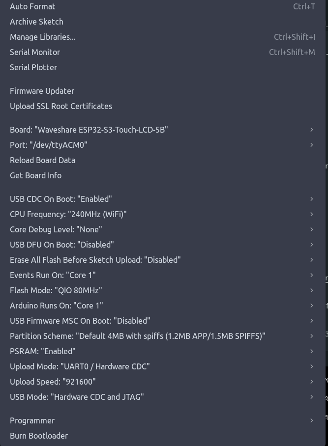

# Pokemon Card Expositor

<!-- Badges -->
<p align="left">
   <a href="https://github.com/mrheltic/PokemonCardExpositor-Firmware/issues"></a>
   <a href="https://github.com/mrheltic/PokemonCardExpositor-Firmware/commits/main"></a>
   <a href="https://github.com/mrheltic/PokemonCardExpositor-Firmware/contributors"></a>
   <a href="https://github.com/mrheltic/PokemonCardExpositor-Firmware/stargazers"></a>
</p>

<!-- Tech Badges -->
<p align="left">
   
   
   
   
   
   
</p>

This project turns a Waveshare ESP32-S3 board with a 5-inch LCD into a digital Pokemon card display. You can search for cards online, download them, and display them on the device.

## What it does

- Shows Pokemon cards on a 5-inch LCD screen
- Connect via WiFi to control it remotely 
- Download cards from the web interface
- Stores cards on SD card
- Can run in slideshow mode

## What you need

- Waveshare ESP32-S3 RGB 5" LCD board (1024x600 version works best)
- MicroSD card (FAT32 format)
- WiFi connection (optional)

### Board Documentation

- **Wiki**: [ESP32-S3-Touch-LCD-5 Wiki](https://www.waveshare.com/wiki/ESP32-S3-Touch-LCD-5#Resources)
- **Schematic**: [ESP32-S3-Touch-LCD-5-Sch.pdf](https://files.waveshare.com/wiki/ESP32-S3-Touch-LCD-5/ESP32-S3-Touch-LCD-5-Sch.pdf)

## Setup Instructions

### 1. Upload the firmware

   - Open Arduino IDE
   - Go to `File` → `Preferences`
   - Add this URL to "Additional Board Manager URLs":
     ```
     https://raw.githubusercontent.com/espressif/arduino-esp32/gh-pages/package_esp32_index.json
     ```
   - Go to `Tools` → `Board` → `Boards Manager`
   - Search for "ESP32" and install "esp32 by Espressif Systems"

3. **Configure Board Settings**:
   - Select `Tools` → `Board` → `ESP32 Arduino` → `ESP32S3 Dev Module`
   - Set the following parameters:
   - **USB CDC On Boot**: Enabled
   - **Flash Size**: 16MB (or according to your board)
   - **Partition Scheme**: Default 4MB with spiffs

---



4. **Upload the Firmware**:
   - Open `PokemonExpositor.ino` in Arduino IDE
   - Connect your Waveshare ESP32-S3 board via USB
   - Click the Upload button (→)
### 2. Install the tools

Go to the `tools` folder and run:

```bash
pip install -r requirements.txt
npm install
```

### 3. Get some cards

Start the server:
```bash
node server.js
```

Open `http://localhost:3000` in your browser. Search for cards and download them. The site can be slow sometimes, just wait it out.

Cards get saved to `images/raw/`.

### 4. Put cards on the device

- Put a FAT32 SD card in your device and turn it on
- It'll create an `images` folder automatically  
- Copy your cards from `images/raw/` to the SD card's `images` folder
- Put the SD card back in the device

### 5. Control it

The device connects to WiFi in two ways:

**Client mode**: Connects to your WiFi network. Check the serial monitor for the IP address.

**Access Point mode**: If it can't connect to WiFi, it creates its own network called "PokemonExpositor". Connect to it and go to `http://192.168.4.1`.

## Files and folders

```
📦 PokemonCardExpositor-Firmware
├── 🎮 PokemonExpositor.ino          # Main firmware file
├── 📊 *.h / *.cpp                   # System components
├── 🖼️ images/                       # Image storage
│   ├── converted/                   # Processed images
│   ├── downloaded/                  # Raw downloads
│   └── raw/                        # Ready-to-use images
└── 🛠️ tools/                        # Development tools
    ├── 🌐 server.js                 # Node.js web server
    ├── 🐍 *.py                      # Python processing scripts
    ├── 📦 package.json              # Node dependencies
    └── 📋 requirements.txt          # Python dependencies
```

## Configuration

Edit `project_config.h` to change:
- WiFi settings
- Display brightness and timing
- Debug output
- Enable/disable features

## Problems?

**Device won't start**: Check your SD card is FAT32 formatted. Look at the serial monitor (115200 baud).

**WiFi not working**: Double-check your WiFi password. Try access point mode instead.

**No cards showing**: Make sure images are in the `images/` folder on the SD card.

**Web interface won't load**: Check the IP address in serial monitor. Try a different browser.

## ⚠️ Known issues

**Hardware stuff**:
- Some fast SD cards don't work - stick to Class 10 or slower (tested only with a 32GB samsung one)
- Screen can flickers sometimes when changing images, expecially in the upper part of the card

**Software stuff**:
- Pokemon API sometimes blocks you if you download too much (easy to reach, you need to wait and then add the new cards after some hours)
- Really big images (>2048px) might not convert properly  
- WiFi drops out occasionally (it tries to reconnect automatically)

**Performance**:
- Takes 10-15 seconds to boot up
- First image load is slow while it processes
- Card search can be slow when lots of people are using the API

**Compatibility**:
- Arduino IDE 2.3+ might not compile - use 2.2.x
- ESP32 package newer than 2.0.11 can break the display
- Only FAT32 SD cards work

**Quick fixes**:
- If it crashes, restart it
- If API is limiting you, wait a couple hours
- If WiFi is flaky, power cycle the device
- If compilation fails, clear Arduino cache and restart

Most of these are being worked on. Check the GitHub issues for updates.

## Contributing

Anyone can contribute! Here's how:

- Found a bug? Report it
- Have an idea? Suggest it  
- Want to code? Fork the repo and make a pull request
- Documentation unclear? Help improve it
- Built one? Show it off!

Standard GitHub workflow:
1. Fork this repo
2. Make a branch (`git checkout -b cool-feature`)
3. Commit changes (`git commit -m 'Add cool feature'`)
4. Push it (`git push origin cool-feature`)
5. Open a pull request

## License

This is licensed under CC BY-NC-SA 4.0.

What that means:
- ✅ You can share, copy, and modify this
- ✅ You must credit the original project
- ✅ If you change it, share under the same license
- ❌ You can't use it commercially

Full license: [CC BY-NC-SA 4.0](https://creativecommons.org/licenses/by-nc-sa/4.0/)

Pokemon and Pokemon cards are trademarks of their owners. This is just for fun and learning.

---

Made for Pokemon card fans